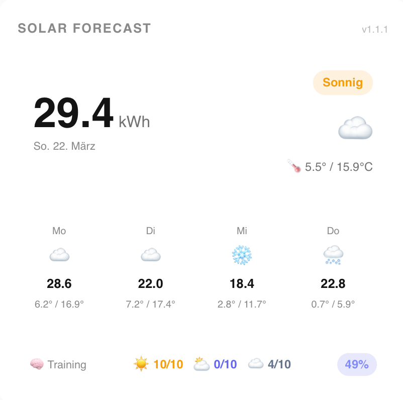

# SolarIndex Card

Lovelace card for the [SolarIndex](https://github.com/Cangos655/solarindex-ha) Home Assistant integration.

Displays solar yield forecasts, weather conditions, and ML training progress at a glance.



## Requirements

The [SolarIndex Integration](https://github.com/Cangos655/solarindex-ha) must be installed and configured.

## Installation via HACS

1. In HACS → Frontend → Add custom repository: `https://github.com/Cangos655/solarindex-card`
2. Install **SolarIndex Card**
3. Clear browser cache (Ctrl+Shift+R)

## Usage

The card auto-discovers your SolarIndex sensors. Just add it to your dashboard:

```yaml
type: custom:solarindex-card
title: Solar Forecast  # optional
```

Sensors can also be configured manually (e.g. if you have multiple instances):

```yaml
type: custom:solarindex-card
title: Solar Forecast
entity_today: sensor.solarindex_today
entity_tomorrow: sensor.solarindex_tomorrow
entity_day3: sensor.solarindex_day_3
entity_day4: sensor.solarindex_day_4
entity_accuracy: sensor.solarindex_model_accuracy
entity_training: sensor.solarindex_training_count
entity_condition: sensor.solarindex_today_condition
```

## Display

- **Today**: Forecasted daily yield, weather condition, temperature
- **Outlook**: Tomorrow + 2 more days
- **Training**: Compact ML model overview (Sunny / Mixed / Overcast · Accuracy)
